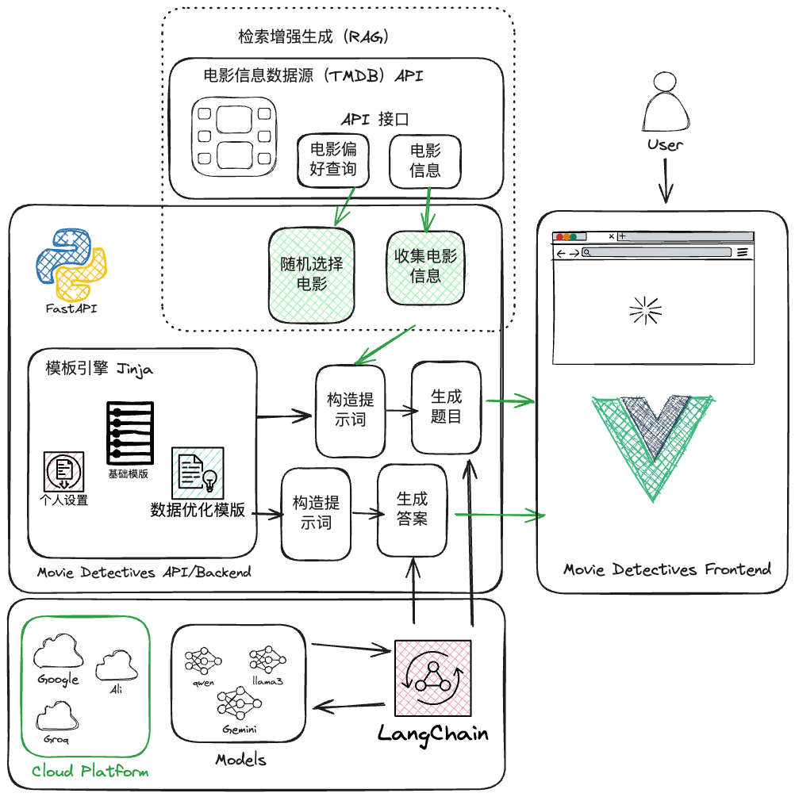
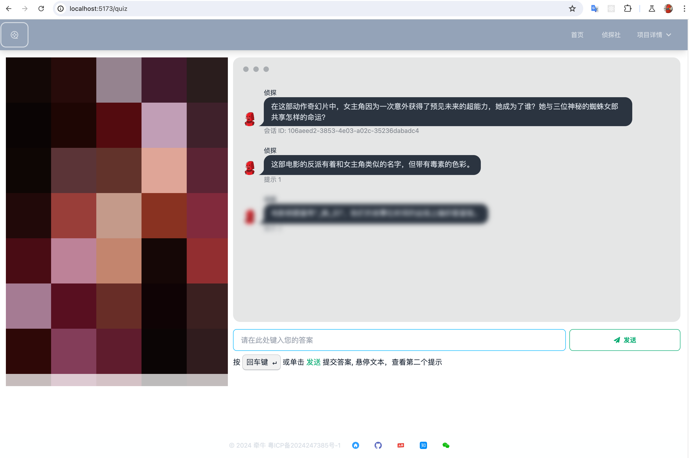

# 骆驼电影侦探 server


《骆驼电影侦探》是一个利用 Llama3 模型的能力，结合来自 The Movie Database (TMDB) 最新电影数据打造的吸引人的测验游戏项目。  
  
亲自体验一下：[骆驼电影侦探](https://movie.qianniu.city/)  

## 后端

项目的后端是用 FastAPI 和 Python 搭建的，它采用检索增强生成（RAG）技术，借助实时的元数据来丰富查询内容。通过使用 Jinja 模板技术，后端将问题提示的生成流程分为基础模板、个性化模板和数据增强模板，从而使生成的测验问题不仅准确，而且充满吸引力。 

## 前端

前端则是基于 Vue 3 和 Vite 构建的，daisyUI 和 Tailwind CSS 的支持让前端开发更加高效。这些工具共同为用户提供了一个流畅和现代的界面，使得与后端的交互变得无缝。  

## LLM
- llama3
- Gemini-1.5
- qwen-long

## 总结

在《骆驼电影侦探》中，测验的答案将再次被语言模型（LLM）解释，这样不仅可以进行动态评分，还能提供个性化的反馈。这一点展示了将大语言模型和检索增强生成技术结合应用于游戏设计和开发的巨大潜力，为打造真正个性化的游戏体验铺平了道路。此外，它还显示了通过引入大语言模型，创造吸引人的测验或教育游戏的可能性。通过简单地添加或修改 Jinja 模板模块，就能轻松地添加和更改角色个性或语言。这种方式极大地减轻了开发者的负担，使游戏体验能够轻松改变。亲自试试吧，去测验设置中更换 AI 的个性，体验不同的游戏风格。  


前端: [movie-detectives-web](https://github.com/qianniucity/movie-detectives-web)

- [骆驼电影侦探 server](#骆驼电影侦探-server)
  - [后端](#后端)
  - [前端](#前端)
  - [LLM](#llm)
  - [总结](#总结)
  - [技术堆栈和项目概述](#技术堆栈和项目概述)
  - [项目配置](#项目配置)
  - [配置说明](#配置说明)
  - [Docker](#docker)
    - [构建](#构建)
    - [运行](#运行)
    - [备份开发镜像](#备份开发镜像)
  - [API 使用示例](#api-使用示例)
    - [获取影片列表](#获取影片列表)
    - [获取自定义电影列表](#获取自定义电影列表)
  - [随机获取一部电影，和影片详情](#随机获取一部电影和影片详情)
    - [开始测验](#开始测验)
      - [使用默认配置开始测验](#使用默认配置开始测验)
      - [数据核实](#数据核实)
    - [发送答案并完成测验](#发送答案并完成测验)
  - [访问频率限制](#访问频率限制)
- [个性化设置](#个性化设置)
  - [举例说明： 圣诞老人](#举例说明-圣诞老人)
- [支持的语言](#支持的语言)
  - [示例：德语版本](#示例德语版本)

## 技术堆栈和项目概述

- 使用 Python 3.12 和 [FastAPI](https://fastapi.tiangolo.com/) 进行 API 开发  
- 通过 [httpx](https://www.python-httpx.org/) 实现与 TMDB 的集成  
- 利用 [Jinja](https://jinja.palletsprojects.com/) 模板进行灵活的提示信息生成  
- 使用 [Pydantic](https://docs.pydantic.dev/latest/) 进行精确的数据建模和验证  
- 采用 [Poetry](https://python-poetry.org/) 管理项目依赖  
- 通过 [Docker](https://www.docker.com/) 实现应用部署  
- 利用 [TMDB API](https://www.themoviedb.org/) 获取最新的电影数据  
- 结合 [VertexAI](https://cloud.google.com/vertex-ai) 和 [Gemini](https://cloud.google.com/vertex-ai/docs/generative-ai/model-reference/gemini) 生成有趣的测验问题并对答案进行评估  
- 使用 [Ruff](https://docs.astral.sh/ruff/) 作为代码的 Linter 和格式化工具，并结合 [pre-commit](https://pre-commit.com/) 钩子提升代码质量  
- 在每次推送时自动运行测试和 linter 的 Github 操作



*电影侦探 - 系统概述*

## 项目配置  
**配置环境**:
```sh
conda create -n movie_detectives python=3.12.9
conda activate movie_detectives 
```

**安装项目依赖**:
```sh
pip install poetry
poetry install
```
  
**(可选) 设置 poetry 在项目内创建虚拟环境**:  
```sh  
poetry config virtualenvs.in-project true  
```


**启动项目**:
```sh
uvicorn api.main:app --reload --host 0.0.0.0 --port 8000
curl -s localhost:8000/api/movies | jq .
```

## 配置说明

**需要准备的事项**

- TMDB API 密钥 ([可免费获取](https://developer.themoviedb.org/docs/getting-started))
- 一个已经启用 VertexAI API 的 GCP（Google Cloud Platform）项目
- 一个拥有 VertexAI 权限的 GCP 服务账号的 JSON 认证文件

API 的配置是通过环境变量完成的。如果项目的根目录下有 `.env` 文件，系统会自动加载它。以下环境变量必须被正确设置：

- `TMDB_API_KEY`: The Movie Database (TMDB) 的 API 密钥。
- `GCP_PROJECT_ID`: 用于 VertexAI 和 Gemini 的 Google Cloud Platform (GCP) 项目 ID。
- `GCP_LOCATION`: 预测处理使用的地区。
- `GCP_SERVICE_ACCOUNT_FILE`: 用于 GCP 认证的服务账号文件路径。

还有一些带有默认值的配置变量，你可以通过它们来调整 API 的默认行为。

## Docker

### 构建

```sh
docker image rm movie-detectives-server
docker build -t movie-detectives-server .
```

### 运行

```sh
docker run -d --name movie-detectives-server -p 9091:9091 --add-host=host.docker.internal:host-gateway movie-detectives-server 
curl -s localhost:9091/api/movies | jq .
docker stop movie-detectives-server
```

### 备份开发镜像

```sh
docker save movie-detectives-server:latest | gzip > movie-detectives-server_latest.tar.gz
```

## API 使用示例

### 获取影片列表

```sh
curl -s localhost:8000/api/movies | jq .
```

### 获取自定义电影列表

```sh
curl -s "localhost:8000/api/movies?page=3&vote-avg-min=8&vote-count-min=1000" | jq ".[0]"
```

```json
{
  "adult": false,
  "backdrop_path": "/eHMh7kChaNeD4VTdMCXLJbRTzcI.jpg",
  "genre_ids": [
    18,
    36,
    10752
  ],
  "id": 753342,
  "original_language": "en",
  "original_title": "Napoleon",
  "overview": "An epic that details the checkered rise and fall of French Emperor Napoleon Bonaparte and his relentless journey to power through the prism of his addictive, volatile relationship with his wife, Josephine.",
  "popularity": 193.344,
  "poster_path": "/vcZWJGvB5xydWuUO1vaTLI82tGi.jpg",
  "release_date": "2023-11-22",
  "title": "Napoleon",
  "video": false,
  "vote_average": 6.484,
  "vote_count": 1953,
  "poster_url": "https://image.tmdb.org/t/p/original/vcZWJGvB5xydWuUO1vaTLI82tGi.jpg"
}
```

## 随机获取一部电影，和影片详情

```sh
curl -s localhost:8000/api/movies/random | jq .
```

```json
{
  "adult": false,
  "backdrop_path": "/oe7mWkvYhK4PLRNAVSvonzyUXNy.jpg",
  "belongs_to_collection": null,
  "budget": 85000000,
  "genres": [
    {
      "id": 28,
      "name": "Action"
    },
    {
      "id": 53,
      "name": "Thriller"
    }
  ],
  "homepage": "https://www.amazon.com/gp/video/detail/B0CH5YQPZQ",
  "id": 359410,
  "imdb_id": "tt3359350",
  "original_language": "en",
  "original_title": "Road House",
  "overview": "Ex-UFC fighter Dalton takes a job as a bouncer at a Florida Keys roadhouse, only to discover that this paradise is not all it seems.",
  "popularity": 1880.547,
  "poster_path": "/bXi6IQiQDHD00JFio5ZSZOeRSBh.jpg",
  "production_companies": [
    {
      "id": 21,
      "logo_path": "/usUnaYV6hQnlVAXP6r4HwrlLFPG.png",
      "name": "Metro-Goldwyn-Mayer",
      "origin_country": "US"
    },
    {
      "id": 1885,
      "logo_path": "/xlvoOZr4s1PygosrwZyolIFe5xs.png",
      "name": "Silver Pictures",
      "origin_country": "US"
    }
  ],
  "production_countries": [
    {
      "iso_3166_1": "US",
      "name": "United States of America"
    }
  ],
  "release_date": "2024-03-08",
  "revenue": 0,
  "runtime": 121,
  "spoken_languages": [
    {
      "english_name": "English",
      "iso_639_1": "en",
      "name": "English"
    }
  ],
  "status": "Released",
  "tagline": "Take it outside.",
  "title": "Road House",
  "video": false,
  "vote_average": 7.14,
  "vote_count": 1182,
  "poster_url": "https://image.tmdb.org/t/p/original/bXi6IQiQDHD00JFio5ZSZOeRSBh.jpg"
}
```

### 开始测验

```sh
curl -s -X POST localhost:8000/api/quiz \
  -H 'Content-Type: application/json' \
  -d '{"vote_avg_min": 5.0, "vote_count_min": 1000.0, "popularity": 3}' | jq .
```

```json
{
  "quiz_id": "84c19425-c179-4198-9773-a8a1b71c9605",
  "question": {
    "question": "Imagine a family road trip, but not just any road trip, a life-or-death race against time! A giant space rock is hurtling towards Earth, and this family is trying to outrun the end of the world. Along the way, they witness cities crumbling like sandcastles and meet people who are both kind and cruel. Can they make it to safety in time?",
    "hint1": "The movie is all about a family trying to survive a global catastrophe.",
    "hint2": "Gr_e_l_nd"
  },
  "movie": {...}
}
```

#### 使用默认配置开始测验

```sh
curl -s -X POST localhost:8000/api/quiz | jq .
```

#### 数据核实

API 利用 Pydantic 对输入数据进行了校验。如果发现输入数据有误，API 会返回一条错误信息：

```sh
curl -s -X POST localhost:8000/api/quiz \
  -H 'Content-Type: application/json' \
  -d '{"vote_avg_min": 11.0}' | jq .
```

```json
{
  "detail": [
    {
      "type": "less_than_equal",
      "loc": [
        "body",
        "vote_avg_min"
      ],
      "msg": "Input should be less than or equal to 9",
      "input": 11.0,
      "ctx": {
        "le": 9.0
      },
      "url": "https://errors.pydantic.dev/2.6/v/less_than_equal"
    }
  ]
}
```

### 发送答案并完成测验

```sh
curl -s -X POST localhost:8000/api/quiz/84c19425-c179-4198-9773-a8a1b71c9605/answer \
  -H 'Content-Type: application/json' \
  -d '{"answer": "Greenland"}' | jq .
```

```json
{
  "quiz_id": "84c19425-c179-4198-9773-a8a1b71c9605",
  "question": {...},
  "movie": {...},
  "user_answer": "Greenland",
  "result": {
    "points": "3",
    "answer": "Congratulations! You got it! Greenland is the movie we were looking for. You're like a human GPS, always finding the right way!"
  }
}
```

## 访问频率限制  
  
为了控制成本和预防滥用情况，这个 API 提供了一个方法来限制每天可以进行的测验会话数。  
  
存在一个默认的限制值，但通过设置一个名为 `QUIZ_RATE_LIMIT` 的环境变量可以修改这个值。该限制每天在午夜时重置。API 还提供了一个端点，用于查看当前的限制和使用情况： 


```sh
curl -s localhost:8000/api/limit | jq .
```

```json
{
  "daily_limit": 100,
  "quiz_count": 0,
  "last_reset_time": "2024-04-06T12:39:29.857703",
  "last_reset_date": "2024-04-06",
  "current_date": "2024-04-06"
}
```

一旦启动了一个测验，并且当前日期 `current_date` 超过了最后重置日期 `last_reset_date`，那么 `quiz_count` 将被重置为 0。

# 个性化设置

得益于生成提示的模块化设计，可以轻松更换测验主持人的个性。这些个性通过位于 `api/templates/personality/` 目录下的 Jinja 模板来定义。它们通过 `api/prompt.py` 中的一个强类型枚举 StrEnum 来管理，这样便于进行扩展。


## 举例说明： 圣诞老人



下面的示例显示了如何切换到圣诞老人/圣诞节个性测验：

```sh
curl -s -X POST localhost:8000/api/quiz \
  -H 'Content-Type: application/json' \
  -d '{"vote_avg_min": 5.0, "vote_count_min": 1000.0, "popularity": 3, "personality": "christmas"}' | jq .
```

```json
{
  "quiz_id": "e1d298c3-fcb0-4ebe-8836-a22a51f87dc6",
  "question": {
    "question": "Ho ho ho, this movie takes place in a world of dreams, just like the dreams children have on Christmas Eve after seeing Santa Claus! It's about a team who enters people's dreams to steal their secrets. Can you guess the movie? Merry Christmas!",
    "hint1": "The main character is like a skilled elf, sneaking into people's minds instead of houses. ",
    "hint2": "I_c_p_i_n "
  },
  "movie": {...}
}
```

# 支持的语言  
  
得益于生成提示的模块化设计，我们同样可以轻松地更改游戏的语言版本。不同语言的设置文件存放在 `api/templates/language/` 目录下的 Jinja 模板中。通过 `api/prompt.py` 中的一个强类型枚举 `StrEnum` 来管理这些语言设置，从而便于进行扩展。  
  
## 示例：德语版本  
  
下面的示例演示了如何为一个测验切换到德语：  

```sh
curl -s -X POST localhost:8000/api/quiz \
  -H 'Content-Type: application/json' \
  -d '{"vote_avg_min": 5.0, "vote_count_min": 1000.0, "popularity": 3, "language": "german"}' | jq .
```

```json
{
  "quiz_id": "7f5f8cf5-4ded-42d3-a6f0-976e4f096c0e",
  "question": {
    "question": "Stellt euch vor, es gäbe riesige Monster, die auf der Erde herumtrampeln, als wäre es ein Spielplatz! Einer ist ein echtes Urviech, eine Art wandelnde Riesenechse mit einem Atem, der so heiß ist, dass er euer Toastbrot in Sekundenschnelle rösten könnte. Der andere ist ein gigantischer Affe, der so stark ist, dass er Bäume ausreißt wie Gänseblümchen. Und jetzt ratet mal, was passiert? Die beiden geraten aneinander, wie zwei Kinder, die sich um das letzte Stück Kuchen streiten! Wer wird wohl gewinnen, die Riesenechse oder der Superaffe? Das ist die Frage, die sich die ganze Welt stellt! ",
    "hint1": "Der Film spielt in einer Zeit, in der Monster auf der Erde wandeln.",
    "hint2": "G_dz_ll_ vs. K_ng "
  },
  "movie": {...}
}
```
